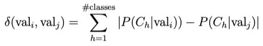
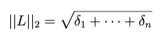

# vdm3

Value difference metric was introduced in 1986 to provide an appropriate distance function for symbolic attributes. It is based on the idea that the goal of finding the distance is to find the right class by looking at the following conditional probabilities. <br>
 <br>
Then the distance is calculated by the Euclidean Distance: <br>
 <br>

```
ValueDifferenceMetric(X=X, y=y)
```
## Parameters:
  - X: ndarray, DataFrame, Series
  - y: tuple, list, ndarray, Series

# Usage
Consider the following example: <br>
```python
>>> columns = {
    'Gender':['F','F','F','M','F','F','F','F','M','F'],
    'Marital':['UN','S','M','M','S','M','M','S','D','M'],
    'Lead':['REF','INTINT','REF','INTINT','RADIO','REF','INTER','PPC','PPC','RADIO'],
    'PrevEd':['SOMECOLL','SOMECOLL','ASSOC','BACH','BACH','ASSOC','UN','SOMECOLL','BACH','SOMECOLL'],
    'Citizen':['US','US','US','US','US','ELNC','US','US','US','US']
      }

>>> X = pd.DataFrame(columns)
>>> y = np.array([0,0,1,0,0,0,0,0,0,1])
```
Initiate the example by: <br>
```python
>>> case = ValueDifferenceMetric(X=X,y=y)
>>> case.vdm_pairs_fit()
```
Get the vdm distance of two points by:
```python
>>> point1 = ['F','D','INTER','ASSOC','ELNC']
>>> point2 = ['M', 'S', 'PPC', 'SOMECOLL', 'US']

>>> case.get_points_distance(point1=point1, point2=point2)
0.20249595200313472
```
Return 0 if two points are the same: <br>
```python
>>> case.get_points_distance(point1=point1, point2=point1)
0.0
```

# Attributes
  - all_pairs
    - all vdm distance pairs from the class instances.

# Methods
  - get_cond_prob(x=x,y=y)
    - return a dictionary contains the conditional probabilities of an input x array and y array.
  - vdm(x=x,y=y)
    - return a dictionary contains all the vdm pairs and the respective conditional probability of an input x array and y array.
  - vdm_pairs_fit()
    - fit vdm with the class instances.
  - get_points_distance(point1=point1,point2=point2)
    - return the distance of two points using the conditional probabilities that learned from the class instances.
